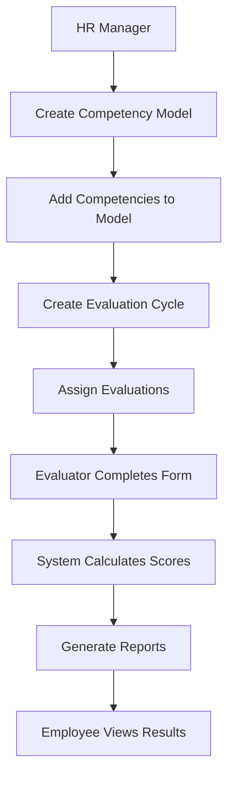
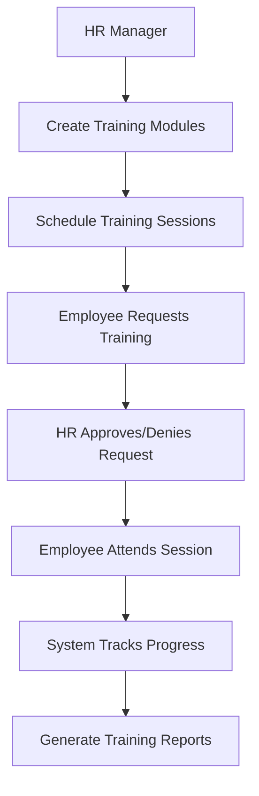
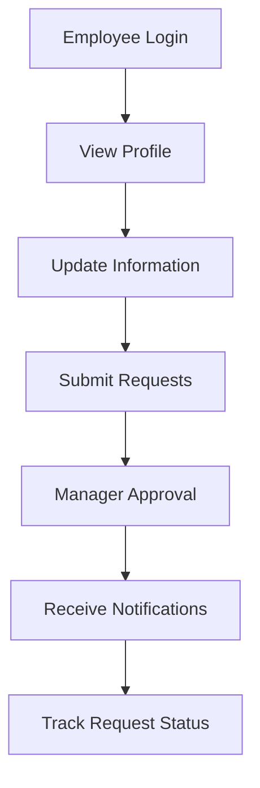

# HR1 System: Complete Process & Dataflow Documentation

## 📋 Table of Contents
- [System Architecture Overview](#system-architecture-overview)
- [Core Data Flow Processes](#core-data-flow-processes)
- [Database Schema & Relationships](#database-schema--relationships)
- [Business Process Workflows](#business-process-workflows)
- [Security & Access Control](#security--access-control)
- [Data Flow Patterns](#data-flow-patterns)
- [System Integration Points](#system-integration-points)
- [Technical Implementation Details](#technical-implementation-details)

---

## 🏗️ System Architecture Overview

The HR1 system follows a **layered architecture** with clear separation of concerns:

```
┌─────────────────────────────────────────────────────────────┐
│                    PRESENTATION LAYER                      │
│  (Bootstrap UI, JavaScript, AJAX, Modals, Forms)          │
└─────────────────────────────────────────────────────────────┘
                              │
                              ▼
┌─────────────────────────────────────────────────────────────┐
│                    APPLICATION LAYER                        │
│  (index.php Router, Page Controllers, Business Logic)      │
└─────────────────────────────────────────────────────────────┘
                              │
                              ▼
┌─────────────────────────────────────────────────────────────┐
│                    SERVICE LAYER                           │
│  (SimpleAuth, CompetencyManager, Database Functions)       │
└─────────────────────────────────────────────────────────────┘
                              │
                              ▼
┌─────────────────────────────────────────────────────────────┐
│                    DATA LAYER                              │
│  (MySQL Database, 16 Tables, Relationships)               │
└─────────────────────────────────────────────────────────────┘
```

### Key Components:

| Layer | Components | Purpose |
|-------|------------|---------|
| **Presentation** | Bootstrap CSS, JavaScript, AJAX | User interface and interactions |
| **Application** | index.php, Page controllers | Request routing and business logic |
| **Service** | SimpleAuth, CompetencyManager | Core business services |
| **Data** | MySQL database, 16 tables | Data persistence and relationships |

---

## 🔄 Core Data Flow Processes

### 1. Authentication & Authorization Flow

```
User Login → Password Verification → Session Creation → Role Assignment → Page Access Control
     ↓              ↓                    ↓                ↓              ↓
[Login Form] → [SimpleAuth] → [Session Storage] → [Permission Check] → [Page Router]
```

**Process Steps:**
1. **User Input**: Username and password entered via login form
2. **Authentication**: `SimpleAuth` class verifies credentials against database
3. **Session Creation**: PHP session established with user data
4. **Role Assignment**: User role (admin/hr_manager/employee) stored in session
5. **Access Control**: Permission checks before accessing any page

**Key Files:**
- `auth/login.php` - Login form and processing
- `includes/functions/simple_auth.php` - Authentication logic
- `index.php` - Session validation and routing

### 2. Main Application Flow

```
Request → Authentication → Page Router → Module Controller → Database → Response
    ↓           ↓              ↓              ↓              ↓         ↓
[HTTP] → [Session Check] → [Switch Case] → [Page Logic] → [MySQL] → [HTML/JSON]
```

**Detailed Process:**
1. **Request Reception**: `index.php` receives HTTP requests
2. **Authentication Check**: Verifies user session and permissions
3. **Page Routing**: Routes to appropriate module based on `?page=` parameter
4. **Module Processing**: Executes business logic for the requested page
5. **Database Interaction**: Queries/updates data as needed
6. **Response Generation**: Returns HTML page or JSON for AJAX

**Routing Logic:**
```php
switch($page) {
    case 'dashboard':
        include 'pages/dashboard.php';
        break;
    case 'competency_models':
        include 'pages/competency_models.php';
        break;
    case 'evaluation_cycles':
        include 'pages/evaluation_cycles.php';
        break;
    // ... more cases
}
```

### 3. Competency Management Process

```
Model Creation → Competency Addition → Cycle Setup → Evaluation Assignment → Scoring → Reporting
      ↓                ↓                  ↓              ↓                ↓         ↓
[Models Page] → [Competencies] → [Cycles Page] → [Evaluations] → [Forms] → [Reports]
```

**Workflow Steps:**
1. **Create Competency Model**: Define framework with competencies
2. **Add Competencies**: Individual skills/behaviors with weights
3. **Setup Evaluation Cycle**: Define evaluation periods
4. **Assign Evaluations**: Link employees to evaluators and models
5. **Conduct Evaluations**: Score competencies via forms
6. **Generate Reports**: Analyze results and trends

### 4. Training Management Process

```
Course Creation → Session Scheduling → Enrollment → Progress Tracking → Completion → Certification
      ↓                ↓                  ↓              ↓                ↓         ↓
[Learning Mgmt] → [Training Mgmt] → [Requests] → [Sessions] → [Tracking] → [Reports]
```

---

## 🗄️ Database Schema & Relationships

### Core Entity Relationships:

```
users (1) ←→ (M) competency_models
users (1) ←→ (M) evaluation_cycles  
users (1) ←→ (M) evaluations (as employee)
users (1) ←→ (M) evaluations (as evaluator)
competency_models (1) ←→ (M) competencies
evaluation_cycles (1) ←→ (M) evaluations
evaluations (1) ←→ (M) competency_scores
```

### Key Tables & Their Roles:

| Table | Purpose | Key Relationships | Key Fields |
|-------|---------|-------------------|------------|
| `users` | Central user entity | Links to all other tables | id, username, role, status |
| `competency_models` | Evaluation frameworks | Created by users, contains competencies | id, name, category, assessment_method |
| `competencies` | Individual skills | Belongs to models, scored in evaluations | id, model_id, name, weight, max_score |
| `evaluation_cycles` | Evaluation periods | Contains multiple evaluations | id, name, type, start_date, end_date |
| `evaluations` | Evaluation assignments | Links employees, evaluators, models | id, cycle_id, employee_id, evaluator_id, model_id |
| `competency_scores` | Actual scores | Individual competency ratings | id, evaluation_id, competency_id, score |

### Database Schema Overview:

```sql
-- Core Tables Structure
users (id, username, email, password_hash, role, status, ...)
competency_models (id, name, description, category, target_roles, assessment_method, ...)
competencies (id, model_id, name, description, weight, max_score, ...)
evaluation_cycles (id, name, type, start_date, end_date, status, ...)
evaluations (id, cycle_id, employee_id, evaluator_id, model_id, status, ...)
competency_scores (id, evaluation_id, competency_id, score, comments, ...)
```

---

## 🎯 Business Process Workflows

### A. Employee Evaluation Workflow



**Detailed Steps:**
1. **Model Creation**: HR Manager creates competency model with framework
2. **Competency Addition**: Individual competencies added with weights and descriptions
3. **Cycle Setup**: Evaluation period defined with start/end dates
4. **Evaluation Assignment**: Employees linked to evaluators and models
5. **Form Completion**: Evaluators score competencies via web forms
6. **Score Calculation**: System calculates weighted scores and overall ratings
7. **Report Generation**: Analytics and reports generated for management
8. **Result Access**: Employees view their evaluation results

### B. Training Management Workflow



**Process Details:**
1. **Module Creation**: Training courses and materials defined
2. **Session Scheduling**: Training sessions scheduled with trainers
3. **Enrollment Requests**: Employees request training participation
4. **Approval Process**: HR managers approve or deny requests
5. **Session Attendance**: Employees attend scheduled training
6. **Progress Tracking**: System monitors completion and performance
7. **Report Generation**: Training effectiveness and completion reports

### C. Employee Self-Service Workflow



---

## 🔐 Security & Access Control

### Role-Based Access Matrix:

| Page/Feature | Admin | HR Manager | Employee |
|--------------|-------|------------|----------|
| Dashboard | ✅ | ✅ | ✅ |
| Competency Models | ✅ | ✅ | ❌ |
| Evaluation Cycles | ✅ | ✅ | ❌ |
| Evaluations | ✅ | ✅ | ❌ |
| Evaluation Form | ✅ | ✅ | ✅* |
| Competency Reports | ✅ | ✅ | ❌ |
| My Evaluations | ✅ | ✅ | ✅ |
| Employee Self-Service | ✅ | ✅ | ✅ |
| Learning Management | ✅ | ✅ | ❌ |
| Training Management | ✅ | ✅ | ❌ |
| Training Requests | ✅ | ✅ | ❌ |
| Succession Planning | ✅ | ✅ | ❌ |
| User Management | ✅ | ❌ | ❌ |
| System Settings | ✅ | ❌ | ❌ |
| System Logs | ✅ | ❌ | ❌ |
| Reports | ✅ | ✅ | ❌ |

*Only for assigned evaluations

### Permission Flow:

```
Action Request → Role Check → Permission Validation → Database Query → Response
      ↓              ↓              ↓                    ↓            ↓
[User Action] → [hasPermission()] → [Allow/Deny] → [Data Access] → [Result]
```

**Security Implementation:**
- **Session-based Authentication**: PHP sessions with secure tokens
- **Role-based Authorization**: Permission checks before page access
- **SQL Injection Prevention**: Prepared statements for all database queries
- **XSS Protection**: Input sanitization and output escaping
- **CSRF Protection**: Form tokens for state-changing operations

---

## 📊 Data Flow Patterns

### 1. CRUD Operations Flow

```
Create: Form → Validation → Database Insert → Success Message → Redirect
Read:   Page Load → Database Query → Data Processing → Display
Update: Form → Validation → Database Update → Success Message → Refresh
Delete: Confirmation → Database Delete → Success Message → Redirect
```

**Implementation Example:**
```php
// Create Operation
if (isset($_POST['create_model'])) {
    $modelData = [
        'name' => $_POST['name'],
        'description' => $_POST['description'],
        'category' => $_POST['category'],
        'created_by' => $current_user['id']
    ];
    
    if ($competencyManager->createModel($modelData)) {
        $message = 'Model created successfully!';
    } else {
        $error = 'Failed to create model.';
    }
}
```

### 2. AJAX Operations Flow

```
User Action → JavaScript → AJAX Request → PHP Handler → Database → JSON Response → UI Update
     ↓            ↓            ↓              ↓            ↓           ↓            ↓
[Click Event] → [fetch()] → [HTTP POST] → [Page Logic] → [Query] → [JSON] → [DOM Update]
```

**AJAX Implementation:**
```javascript
function viewModel(modelId) {
    fetch('?page=competency_models&action=get_model_details&id=' + modelId)
        .then(response => response.json())
        .then(data => {
            if (data.success) {
                // Update UI with model data
                populateModal(data.model, data.competencies);
            } else {
                alert('Failed to load model details: ' + data.message);
            }
        });
}
```

### 3. Reporting Flow

```
Report Request → Data Collection → Filtering → Aggregation → Formatting → Display/Export
      ↓              ↓              ↓           ↓            ↓           ↓
[User Selection] → [Multi-table Query] → [WHERE clauses] → [GROUP BY] → [Charts/Tables] → [Output]
```

---

## 🚀 System Integration Points

### Internal Integrations:

| Integration | Description | Implementation |
|-------------|-------------|----------------|
| **Authentication ↔ All Modules** | Every page checks user permissions | `SimpleAuth::isLoggedIn()` and `hasPermission()` |
| **Competency ↔ Evaluation** | Models drive evaluation forms | Foreign key relationships and data queries |
| **Training ↔ Requests** | Modules link to enrollment requests | Database relationships and business logic |
| **Users ↔ All Activities** | Central user entity connects everything | User ID references across all tables |

### External Integrations:

| Integration | Purpose | Status |
|-------------|---------|--------|
| **Email Notifications** | System alerts and updates | Available |
| **File Uploads** | Document and image handling | Implemented |
| **Export Functions** | Data export to CSV/PDF formats | Available |
| **API Endpoints** | External system integration | Planned |

---

## 🔧 Technical Implementation Details

### File Structure:

```
hr1/
├── assets/                 # Static assets (CSS, JS, images)
├── auth/                   # Authentication pages
├── database/               # Database schemas and scripts
├── docs/                   # Documentation
├── includes/               # Core PHP includes
│   ├── data/              # Database connection
│   └── functions/         # Business logic functions
├── pages/                  # Main application pages
├── partials/              # Reusable UI components
└── index.php              # Main application entry point
```

### Key Classes and Functions:

| Component | File | Purpose |
|-----------|------|---------|
| **SimpleAuth** | `includes/functions/simple_auth.php` | Authentication and authorization |
| **CompetencyManager** | `includes/functions/competency.php` | Competency management logic |
| **Database Connection** | `includes/data/db.php` | Database connectivity |
| **Main Router** | `index.php` | Application entry point and routing |

### Database Connection:

```php
function getDB() {
    static $pdo = null;
    if ($pdo === null) {
        $pdo = new PDO(
            "mysql:host=localhost;dbname=hr1_system;charset=utf8mb4",
            "root",
            "",
            [PDO::ATTR_ERRMODE => PDO::ERRMODE_EXCEPTION]
        );
    }
    return $pdo;
}
```

### Error Handling:

```php
try {
    // Database operation
    $stmt = $this->db->prepare($sql);
    $stmt->execute($params);
    return $stmt->fetchAll();
} catch (PDOException $e) {
    error_log("Database error: " . $e->getMessage());
    return false;
}
```

---

## 📈 Performance Considerations

### Database Optimization:
- **Indexed Fields**: Primary keys, foreign keys, and frequently queried fields
- **Prepared Statements**: All database queries use prepared statements
- **Connection Pooling**: Single database connection per request
- **Query Optimization**: Efficient joins and WHERE clauses

### Caching Strategy:
- **Session Data**: User information cached in PHP sessions
- **Static Assets**: CSS/JS files cached by browser
- **Database Queries**: No explicit caching (can be added for performance)

### Scalability:
- **Modular Design**: Easy to add new modules
- **Role-based Access**: Scalable permission system
- **Database Design**: Normalized schema for data integrity

---

## 🔍 Monitoring and Logging

### Activity Logging:
```php
public function logActivity($action, $table, $record_id, $old_data, $new_data) {
    $stmt = $this->db->prepare("
        INSERT INTO system_logs (user_id, action, table_name, record_id, old_data, new_data, ip_address, user_agent)
        VALUES (?, ?, ?, ?, ?, ?, ?, ?)
    ");
    $stmt->execute([
        $_SESSION['user_id'],
        $action,
        $table,
        $record_id,
        json_encode($old_data),
        json_encode($new_data),
        $_SERVER['REMOTE_ADDR'],
        $_SERVER['HTTP_USER_AGENT']
    ]);
}
```

### Error Tracking:
- **PHP Error Logging**: All errors logged to PHP error log
- **Database Error Handling**: PDO exceptions caught and logged
- **User Activity**: All user actions tracked in system_logs table

---

## 🎯 Future Enhancements

### Planned Features:
1. **API Development**: RESTful API for external integrations
2. **Advanced Reporting**: More sophisticated analytics and dashboards
3. **Mobile App**: Native mobile application for employees
4. **Workflow Automation**: Automated approval processes
5. **Integration Hub**: Connect with external HR systems

### Technical Improvements:
1. **Caching Layer**: Redis or Memcached for better performance
2. **Queue System**: Background job processing
3. **Microservices**: Break down into smaller, focused services
4. **Containerization**: Docker deployment for easier scaling

---

This comprehensive documentation provides a complete understanding of the HR1 system's architecture, processes, and data flow. The system is designed with scalability, security, and maintainability in mind, providing a solid foundation for human resources management.

